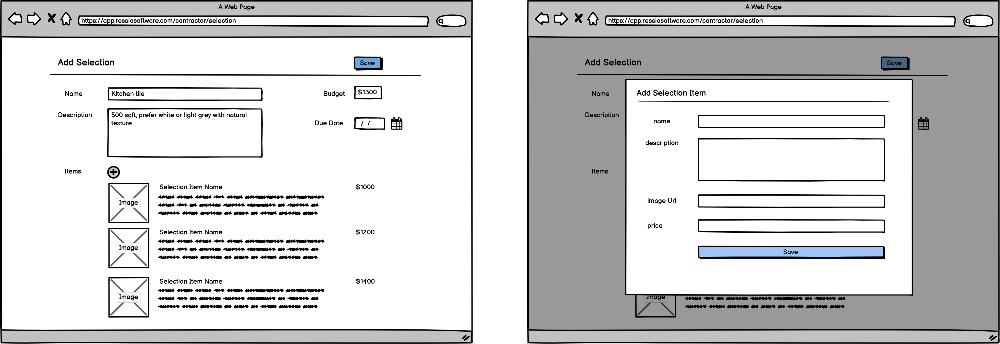

# MCC Test
Welcome! We will be using this repo for our pair-programming test.  We will be working together to implement additional logic (they are marked with `TODO` throughout the repo) to support a real feature. Please take some time to explore the project and familarize yourself with the tech stack and layout.

## The Feature
The feature we are building is the add selection page.  As a real-world example, imagine a contractor using this page to provide a selection of kitchen tiles for an homeowner to pick from.  

Here are the things that an user can do:
* Create a new selection with name, description, budget and due date. This mostly implemented already.
* Add selection item to a selection with an image url, name, descciption, and price.  This is the main focus of the execrise.

Here is a wireframe of what the UI might look like:

## Tech stack
The library used in this test project should give you a good proximation on what we are using at MCC.  We will discuss these dependencies and their role in the architecture, so it would be great to get a basic undersstanding of how they work.

- [next.js](https://nextjs.org/docs) as the foundation the application
- [prisma](https://www.prisma.io/docs/) ORM libray to work with databases
- [zod](https://github.com/colinhacks/zod) typescript-first schema validation
- [react-hook-form](https://react-hook-form.com/) form helper with validations
- [chakra-ui](https://chakra-ui.com/getting-started) component libray for building UI

## Layout
This is a standard [next.js project](https://nextjs.org/docs/api-reference/create-next-app) generated using `yarn create next-app --typescript` with additional bits.  Here are some folders/files that you may want to take a look at:
- `common/model` contains common models and types shared through out the application
- `components/selection.tsx` defines react component with a basic UI to create a new selection
- `server/db/repo` contains logic to load and save data into the database
- `pages/api` contains example of api route for finding and creating selection
- `primsa/schema.prisma` contains configuration for database and mapping to database tables

## Useful commands
- `yarn install` to install dependencies.  This will also generate the latest prisma client
- `yarn dev` to start the application in dev mode, running on http://localhost:3000 by deafult
- `yarn prisma db push` to initialize the database schema
- `yarn prisma generate` to regenerate prisma client after updates to the schema